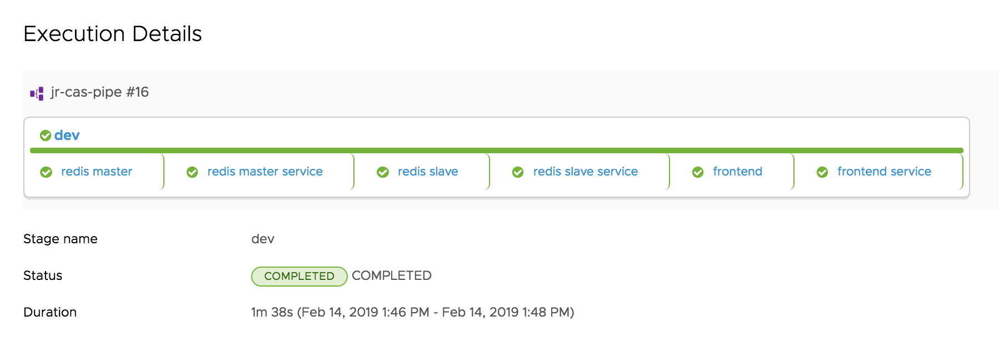

# VMware CAS demo #

## Demonstrate CAS codestream pipeline with endpoint integration to Github and Kubernetes ##

> Multi stage pipeline using kubernetes example app guestbook (redis master/slave with php frontend)

> k8s API access service account creation is required. Cluster admin should not be used. ClusterRole and ClusterRoleBinding yaml definitions attached, using service account and a series of resource objects and verbs.
> helpful commands to verfiy sa > clusterrole > clusterrolebinding

- kubectl get sa -o yaml (*check service account*)
- kubectl get clusterrole -o yaml 
- kubectl get clusterrolebindings -o yaml

> these commands can be used to ensure the service account has permission to create services/deployments in the cluster

- kubectl --namespace=default auth can-i create services --as=system:serviceaccount:default:codestream
- kubectl --namespace=default auth can-i create deployments --as=system:serviceaccount:default:codestream
